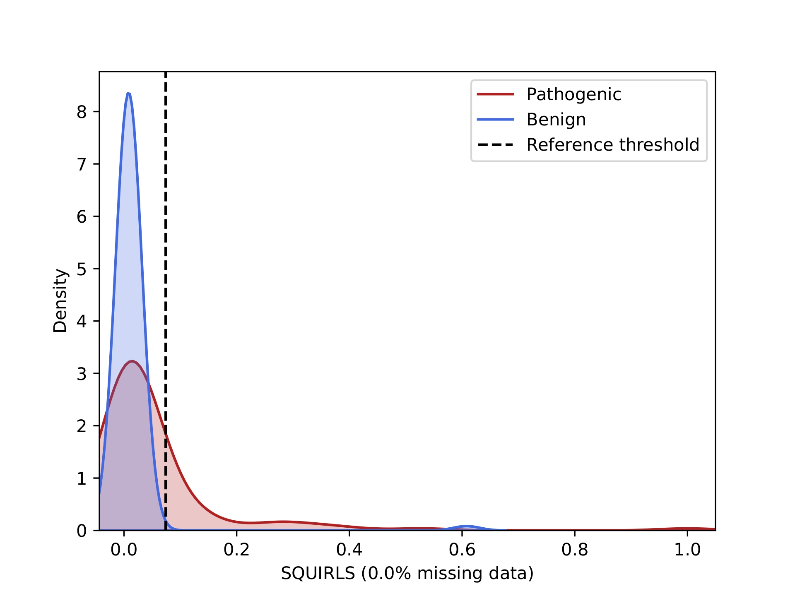
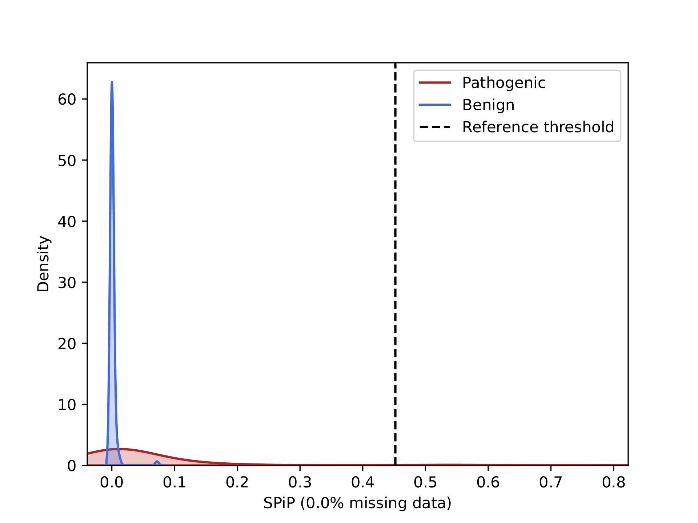

# IRD_prediction_assessment
Inherited retinal degenerations (IRD) are heterogeneous disease groups that are frequently caused by a combination of deep-intronic variants (DIVs). In general, such DIVs are tightly associated with splicing disruptions that include cryptic splice sites. In this project, we have benchmarked the existing tools to evaluate the contribution of various DIVs to the development of IRD.
## Data
Overall, 206 DIVs involving 103 pathogenic and 103 benign were explored. The minimum distance for pathogenic variants from exon-intron junction is 160 bp, for benign variants - 196 bp. Some of the datasets are intersected therefore the sum of pathogenetic variants does not amount to 103. Analysis was performed using GRCh38 genome assembly.

**Pathogenic**
- 57: [Roosing et al](https://www.frontiersin.org/articles/10.3389/fcell.2023.1112270/full)✧
- 4: [Lu Tian et al](https://pubmed.ncbi.nlm.nih.gov/35657619/)
- 3: [Lui et al](https://www.nature.com/articles/s41525-024-00391-2)✦
- 51: experimental data that were provided by Marianna Weener (see Contacts)✦

**Benign**
- 103: [gnomAD](https://gnomad.broadinstitute.org/)

To explore in more detail the datasets were divided into two sets of 57✧ and 54✦ variants. 

## Tools
Preliminarily, the data was annotated with [Ensembl Variant Effect Predictor (VEP)](https://genomebiology.biomedcentral.com/articles/10.1186/s13059-016-0974-4).

For **splicing variant interpretation**, the following tools were used:
- [SpliceAI](https://github.com/Illumina/SpliceAI)
- [Pangolin](https://github.com/tkzeng/Pangolin)
- [SQUIRLS](https://github.com/monarch-initiative/Squirls)
- [CI-SpliceAI](https://github.com/YStrauch/CI-SpliceAI__Annotation)
- [SPiP](https://github.com/LBGC-CFB/SPiP)
- [CADD-Splice](https://github.com/kircherlab/CADD-scripts)
- [PDIVAS](https://github.com/shiro-kur/PDIVAS)
- [MaxEntScan](https://github.com/Congenica/maxentscan)

The obtained scores were processed with [VETA](https://github.com/PedroBarbosa/VETA)
## Results
According to the obtained metrics, SpliceAI, Pangolin and SPiP were selected.

#### AUROC for studied tools *

103 variants            |  54 variants
:-------------------------:|:-------------------------:
  |  

*PDIVAS is not presented since it predicts only 50% of the data

#### Class distribution for SQUIRLS and SPiP

SQUIRLS            |  SPiP *
:-------------------------:|:-------------------------:
  |  

*SpliceAI and Pangolin have the similar distribution.

#### Selected thresholds
 
The thresholds were chosen according to *the F1 score*. The details can be found in `Data_analysis.ipynb`
- Pangolin: 0.05
- SpliceAI: 0.05
- SPiP: 0.015

#### Annotation

With the obtained thresholds DIVs in *USH2A*, *CRB1* and *ABCA4* genes (gnomAD) have been annotated. 

The results are presented in table [ABCA4_CRB1_USH2A_annot.csv](annotation/ABCA4_CRB1_USH2A_annot.csv).

The symbols used:

🟢 Benign

🟡 Pathogenic under one assessment

🟠 Pathogenic under two assessments

🔴 Pathogenic under three assessments

## Contacts
- Supervisor: Marianna Weener
- Ekaterina Shitik
- Ustin Zolotikov
